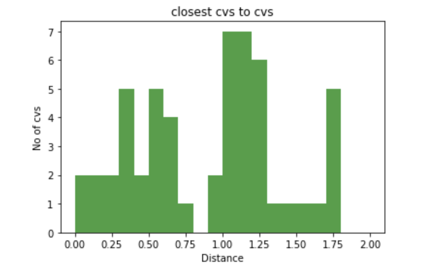

# The Final Report

## Introduction

It is said that we are living in an Age of Data. Data are literally omnipresent in our day-to-day life--Every Ad we see, every video or music recommendation we get, every choice we make--Data act behind the scene. As we, the junior candidates of Data Scientists, set our feet on mastering Data, we always need to learn and ask questions. 

Project Pharmacy begins with a question that: What if we obtain one or two "host" datasets along with several "guest" datasets. Then before continue onto manipulating them, we first assume there is some kinds of relationships between the "host" and the "guest"s. Finally after performing some statistical or operational tests, will the outcomes bring us any interesting conclusions? 

The project treated the CVS/walgreen pharmacy stores in central boston area as the "host" datasets and several other interesting "guest" datasets as described below. Following the guidance of CS504 Data Mechanics, we populate our toolboxes with frameworks such as MapReduce/Relational Paradigm, techniques such as kNN/k-means, concepts such as provenance, And we finally reach the end of this wonderful journey. It is our pleasure to share it with you.

## Obtained Datasets and Resources 

1. **Google Places API (search Nearby)**

2. - Cvs stores within 15 km Boston area 
   - Walgreen stores within 15 km Boston area 
   - 7Eleven stores within 15 km Boston area 
   - Boston supermarket or grocery store using google API 

3. **Boston Data Portal (Analyze Boston)**

4. - [Boston active food establishment](https://data.boston.gov/dataset/active-food-establishment-licenses)
   - [Boston food establishment-inspections](https://data.boston.gov/dataset/food-establishment-inspection)
   - [Boston neighborhood geography](https://data.boston.gov/dataset/boston-neighborhoods/resource/61988228-017f-46e2-ad0c-ff602362b464)

5. **Data Mechanics IO**

6. - [Eviction Incidents ](http://datamechanics.io/data/evictions_boston.csv)in Boston area
   - [Crime Incidents ](http://datamechanics.io/dadta/crime.csv)in Boston area
   - [Boston house_hold income](http://datamechanics.io/data/henryhcy_wangyp/household_income.json)
   - [Boston poverty_rate](http://datamechanics.io/data/henryhcy_wangyp/poverty_rates.json)

## Resulted Collections & Performed Data Transformations 

- walgreenCrime: combine the walgreen dataset and crimes dataset, filtering every crime except for Larceny
- walgreenEviction: combine the walgreen dataset and eviction dataset
- correlationCVS: recorded the calculated results of the correlations between CVS ratings and Larceny cases, CVS ratings and Eviction cases.
- countEvictionCrimeCVS: for every cvs pharmacy store, add two records. One for the number of Larceny cases nearby, and the other for the number of Eviction cases nearby.
- cvsCrime: combine the walgreen dataset and cvs dataset, filtering every crime except for Larceny
- cvsEviction: combine the cvs dataset and eviction dataset
- cvsMBTA: combine the cvs dataset and MBTA dataset
- cvsWalgreen: combine the cvs dataset and walgreen dataset
- ratingCrime: recorded a pair of (ratings, number of larceny cases) for every cvs store
- ratingEviction: recorded a pair of (ratings, number of Eviction cases) for every cvs store
- wal_wal_cvs: For each walgreen store, record the place_id and distance of its closest Walgreen and CVS
- cvs_wal_cvs: For each CVS store, record the place_id and disrance of its closest Walgreen and CVS
- new_cvs: record the potential locations of new CVS store, the way of selection locations is explained in project 2
- solution: recorded the solution for the optimization and the constraint satisfaction problem solved in project 2

***\*Note that some collections are not used in the final version of this project. They were generated when we were exploring the topics.**

## Project Pharmacy: General Description, Narrative, and Results

The project is divided into two tasks, which corresponds to two different directions our team are interested in pursuing.

### Task I: Quantify the Competition between CVS and Walgreen in Boston Area 

1. #### Question: 

   As two of the biggest pharmacy brands, CVS and Walgreen have their stores all around Boston area. We find it interesting that some CVS and Walgreen stores are next to each other. Thus, we make the following hyphothesis: for both CVS and Walgreen, they are trying to locate their stores closer to their competitor than their own stores in order to increase their brand influence and maximize their scope of service. Then we do the following steps to test our hypothesis.

   - For each CVS stores in boston area, we find the closest Walgreen and CVS stores and record their distances
   - Apply step 1. for every Walgreen stores in our dataset 
   - Using statistical analysis running find_Distance.py to test our hypothesis 

   

   This hypothesis about the location selection of CVS and Walgreen that depends on their competitors doesn't hold strongly enough. However, we can say that contrast with CVS, the locations of Walgreen stores are intensive because it has lower mean value and standard deviation. Also, it seems like Walgreen are more likely to locate their stores closer to CVS stores. Furthermore, we plot the following histograms. It is interesting that there are around 16 pairs of CVS and Walgreen right next to each other which is consistent with our intuition.

   

   

   

    

2. #### Further Question: 

   If we want to locate N new cvs stores or walgreen stores, how can we maximize its influence?

3. #### Descriptions of Hypothesis:

   As two of the biggest pharmacy brands, CVS and Walgreen have their stores all around Boston area. We find it interesting that some CVS and Walgreen stores are next to each other. Thus, we make the following hyphothesis: for both CVS and Walgreen, they are trying to locate their stores closer to their competitor than their own stores in order to increase their brand influence and maximize their scope of service. Then we do the following steps to test our hypothesis.

4. #### Solving Process:

   For locating new CVS stores, we use k-means algorithm to find k clusters of Walgreen stores. The locations of the clusters are the potential locations for new CVS stores that could increase brand influence. Then we did the same for new Walgreen stores.

   The locations of potential new CVS and Walgreen stores are stored in our dataset for future use (new_cvs, new_wa）

5. #### Results:

   Three New CVS Locations

   - { "lat" : 42.33149123333333, "lng" : -71.07000355925928 }
   - { "lat" : 42.36790251666666, "lng" : -71.12384277083335 } 
   - { "lat" : 42.44012102222222, "lng" : -71.03259612222222 }
   - 

   Three New Walgreens Locations

   - { "lat" : 42.30725281, "lng" : -71.15437599999998 }
   - { "lat" : 42.36873335, "lng" : -71.02850679999999 } 
   - { "lat" : 42.41221626875, "lng" : -71.16324264375002 }

### Task II: Explore Relationships between CVS, Larceny, and Eviction in the Central Boston

1. #### Data Cleaning & Problems Encountered.

   - Among all type of crimes in the dataset crimes (Simple Assault, Battery, GTA, etc.), we assume that Larceny relates with the convenient store in the most direct way. By obtaining all eviction(14k) & larceny(22k) cases within 5.5km of central Boston, we successfully clustered all of them against the cvs stores(18) within 5km of central Boston.
   - We find it Hard to include all cvs stores (60), eviction cases(25k), and crime cases(270k) within 15km  of central boston. That resulted in many useless data points where there are 0 crime/eviction cases. Worse than that, the size of data and the relatively slow computation of geo distance required a fairly long time(7+ hrs) to run. The run failed when the mongodb cursor was exhausted/timeout-ed. Large and comprehensive do not necessarily mean good in data science.

2. #### Further Exploration of Data & Problem Encountered 

   - In this step, the rating of a store is put together with the store's number of eviction/larceny cases. The data sets are refined before computation. The result stored in collection  correlationCVS shows that rating and eviction cases have a pearson coefficient of 0.39326 with a 0.26090 p-value; the rating and Larceny cases have a pearson coefficient of -0.20018 with a  0.44109 p-value. Neither of them have enough evidence to reject the null hypothesis (no correlation).
   - However, by just looking at the c.c., it is also fair to explain that Eviction implies financially instability therefore affects rating disproportionately. Larceny instead improves the security level of the store therefore can slightly affect rating proportionally. Following this explanation, we refined the model of S such that:  S_i = ( (|L_i|^(c))/(|E_i|) ) times 1000, where c = |rho(rating, larceny)|/|rho(rating, eviction)|.
   - Other problems: 
     Some outliers (i.e. with less than 100 cases) make the p-value too high to be useful. We excluded the outliers and converted the store rating to 100 score based.

3. #### Solve an Optimization Problem

   - **Description:** Finding the model that has the maximum (total stability S, total accessibility A) pair
   - Accessibility Definitions:
     - Accessibility A is defined as the sum of the distances between each pair of salesmen, or each pair of stores that are assigned a salesman.
     - (S1, A1) > (S2, A2) if S1>S2 and A1>A2
   - Results:
     - the 3 CVS are located at 210 Border St, East Boston 101 Canal St suite A, Boston 1249 Boylston St, Boston
     - with a total stability S = 0.4886
     - with a total accessibility A = 11.2147 km 
     - 

4. #### Solve a Constraints Satisfaction Problem

   - **Description:** If we have the chance to send 3 salesmen (1 per store), obtained the model that has the total stability >= S, total accessibility >= A?
   - Results:
     - For S := 0.6; A := 6.0:
     - a possible set of 3 CVS are: 101 Canal St suite A, Boston 1249 Boylston St, Boston 631 Washington St, Boston
     - with a total S = 0.63646
     - with a total A = 7.91282
     - 

## Data Visualization

Python library Folium is implemented to generate the following maps

Fig 1 shows that CVS and Walgreen are gathered in the center of Boston Metro area, and spread out outside Boston. Fig 2 indicates the specific distribution of CVS and Walgreen stores. The red icon represents CVS while the green icon represents Walgreen and the pink icon represents the location where CVS and Walgreen are close to each other. From those two figures, we can tell that beside the center area of Boston where both CVS and Walgreen are compacted, CVS spreads out its stores more and almost each town contains at least one CVS while Walgreen focuses more on targeting the center of Boston.


1. 1. 

## Techniques and Technologies Used

1. Provenance using prov
2. K-means classification
3. Statistical analysis & inference including correlation and hypothesis testing
4. Optimization and Constraint Satisfaction using Z3-solver
5. Interactive geo-Data visualization using Folium
6. RESTful API construction
7. noSQL and SQL database using MongoDB and SQLite
8. Backend Webservice provided by Python & Flask
9. Frontend development using Html, css, and JavaScript

## Web Application Schema

- The file "_DataApp.py" serves as an entry to the the python package located in the folder "FlaskApp"
- In the folder "FlaskApp":
  - the "template" folder is reserved by Flask to store all html templates
  - the "static" folder is reserved by Flask for all static files like css and images
  - file "__init__.py" initializes the web application and connects to two local Databases:
    - MongoDB database holds all the data from project 1 and 2
    - Sqlite database will store all the information leave by a user through the feedback form inside the web application. The schema is defined in models.py
  - file "routes.py" contains all the view functions
  - file "forms.py" defines the schema of the wtforms. Users will use wtforms to interactive with the two databases throught a RESTful API in task2.html and a feedback form in feedback.html
  - file "configs.py" contains all the configuration of the web application, including paths, username, password, and csrf_protection_token.

###To Run this Project

To get the data and correlations:

```shell
python3 execute.py henryhcy_jshen97_leochans_wangyp
```

To start the web service:

```shell
cd henryhcy_jshen97_leochans_wangyp]
flask run
```

## Other required libraries and tools

```
pip install flask --upgrade --no-cache-dir
pip install FlaskApp.config --upgrade --no-cache-dir
pip install flask_sqlalchemy --upgrade --no-cache-dir
pip install geopy --upgrade --no-cache-dir
pip install z3 --upgrade --no-cache-dir
pip install folium --upgrade --no-cache-dir
```