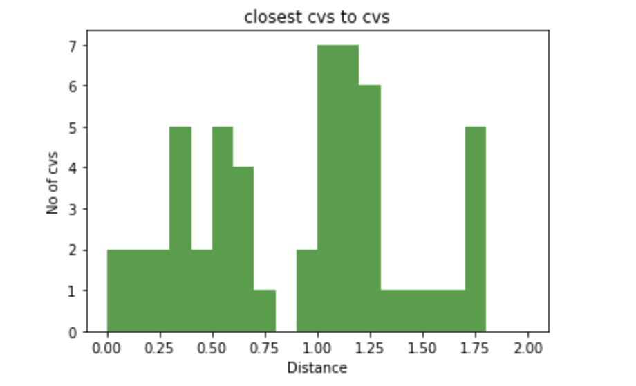
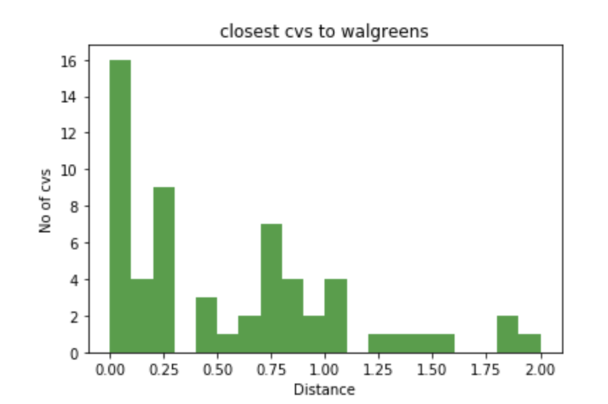

###cs504 Project 2 Modeling, Optimization, and Statistical Analysis

####Team Formation
- **JiaJia shen (jshen97@bu.edu)**
- **Shiwei Chen (leochans@bu.edu)**
- **Yuanpei Wang (wangyp@bu.edu)**
    - Chengyang He (henryhcy@bu.edu) has dropped the course

####Obtained Datasets and Sources
- Cvs stores within 15 km boston area through querying Google Places API (Search Nearby) 
    - (https://maps.googleapis.com/maps/api/place/nearbysearch/json?)
- Walgreen stores within 15 km boston area through querying Google Places API (Search Nearby)
    - (https://maps.googleapis.com/maps/api/place/nearbysearch/json?)
- Streetlight Locations in boston area through querying Boston Data Portal (Analyze Boston)
    - (https://data.boston.gov/api/3/action/datastore_search?resource_id=c2fcc1e3-c38f-44ad-a0cf-e5ea2a6585b5)
- Eviction Incidents in boston area
    - (http://datamechanics.io/data/evictions_boston.csv)
- Crime Incidents in boston area
    - (http://datamechanics.io/dadta/crime.csv)
- MBTA stops in boston area
    - (http://datamechanics.io/data/MBTA_Stops.json)
- **File rlated**: DataRetrieval.py
  
####General Description, Procedure, and Narrative
The project is divided into two tasks:
- **Task One: Quantify Competition Between two major pharmacy brands CVS and Walgreen in Boston area **

    - **Question**: As two of the biggest pharmacy brands, CVS and Walgreen have their stores all around Boston area. We find it interesting that some CVS and Walgreen stores are next to each other. Thus, we make the following hyphothesis: for both CVS and Walgreen, they are trying to locate their stores closer to their competitor than their own stores in order to increase their brand influence and maximize their scope of service. Then we do the following steps to test our hypothesis.

        1. For each CVS stores in boston area, we find the closest Walgreen and CVS stores and record their distances.

        2. Apply step 1. for every Walgreen stores in our dataset. 

        3. Using **statistical analysis** to test our hypothesis.

            

           1. Related script: **find_Distance**

              | CVS (miles)        | Distance to closest Walgreen | Distance to closest CVS |
              | ------------------ | ---------------------------- | ----------------------- |
              | Mean               | 1.32                         | 1.06                    |
              | Standard Deviation | 1.40                         | 0.66                    |
              | Correlation        | 0.35                         | 0.35                    |

              | Walgreen (miles)   | Distance to closest Walgreen | Distance to closest CVS |
              | ------------------ | ---------------------------- | ----------------------- |
              | Mean               | 0.74                         | 0.57                    |
              | Standard Deviation | 0.70                         | 0.59                    |
              | Correlation        | 0.23                         | 0.23                    |

           2. From the above statistical results, we can tell that our previous hypothesis about the location selection of CVS and Walgreen that depends on their competitors doesn't hold strongly enough. However, we can say that contrast with cvs, the locations of Walgreen stores are intensive because it has lower mean value and standard deviation. Also, it seems like Walgreen are more likely to locate their stores closer to CVS stores. 

           3. For further analsis, we plot the following histograms. It is interesting that there are around 16 pairs of CVS and Walgreen right next to each other which is consistent with our intuition.   It is reasonable to believe that density of CVS and Walgreen stores is proportional with the density of population. Hopefully, we can have further investigation about the location selction in next part of the project. 

               

               

               

               

               

               

    - **Optimization problem**: If we want to locate N new CVS stores or Walgreen stores, how can we maximize its influence.

        1. Related scripe: **k_mean**

        2. We believe that a brand can maximize its influence by placing a new store as close as possible to it's competetive brand. In tuition, both CVS and Walgreen have the similar service which means none of them have advantages on having special service or selling distinctive products. Customers will select the most convenient(closest) store. If new cvs store is placed close to some Walgreen stores, it is able to attract some nearby customers from Walgreen to increase its brand influence.

        3. For locating new CVS stores, We use k-means algorithm to find k clusters of Walgreen stores. The locations of the clusters are the potential locations for new CVS stores that could increase brand influence. Then we did the same for new Walgreen stores.

        4. The locations of potential new CVS and Walgreen stores are stored in our dataset for future use （new_cvs, new_wa）

        5. Results: 

            ​		3 new CVS locations: [{ "lat" : 42.33149123333333, "lng" : -71.07000355925928 }, { "lat" : 42.36790251666666, "lng" : -71.12384277083335 },{ "lat" : 42.44012102222222, "lng" : -71.03259612222222 }]

            ​		3 new Walgreen locations : [{"lat" : 42.30725281, "lng" : -71.15437599999998 },{ "lat" : 42.36873335, "lng" : -71.02850679999999 }, { "lat" : 42.41221626875, "lng" : -71.16324264375002 }]
* **Task Two: CVS, Larceny, and Eviction in the Central Boston**
    1. Let's assume and model that the **Stability S** of a store **i** is defined by **S_i = 1/(|E_i||L_i|)** where **|E_i|** and **|L_i|** are the number of eviction cases and the number of larceny cases that are related to store **i**:
    2. Among all type of crimes in the dataset crimes (Simple Assault, Battery, GTA, etc.), we assume that Larceny relates with the convenient store in the most direct way. By obtaining all eviction(**14k**) & larceny(**22k**) cases within **5.5km** of central boston, we successfully clustered all of them against the cvs stores(**18**) within **5km** of central boston.
        - **Note**: The extra **0.5km** is for those cvs stores located near the **5km** boundary.  
        - **Related Files**: CvsWalEviction.py; CvsWalCrime.py; CountEvictionCrimesCVS.py
        - **Key Library**: geopy.distance
        - **Key Concepts**: Data clustering and relational operations.
        - **Problems Encountered**: At the beginning, I was too ambitious. I wanted to include all cvs stores(**60**), eviction cases(**25k**), and crime cases(**270k**) within **15km** of central boston. That resulted in many useless data points where there are **0** crime/eviction cases. Worse than that, the size of data and the relatively slow computation of geo distance required a fairly long time(**7+ hrs**) to run. The run failed when the mongodb cursor was exhausted/timeout-ed. Large and comprehensive do not necessarily mean good in data science. The solution is to constrain our area of interest down to **5km** from the center of boston.
    3. In this step, the rating of a store are put together with the store's number of eviction/larceny cases. The data sets are refined before computation. The result stored in collection **correlationCVS** shows that rating and eviction cases have a pearson coefficient of **0.39326** with a **0.26090** p-value; the rating and Larceny cases have a pearson coefficient of **-0.20018** with a **0.44109** p-value. Neither of them have enough evidence to reject the null hypothesis (no correlation). However, by just looking at the c.c., it is also fair to explain that Eviction implies financially instability therefore affects rating disproportionately. Larceny instead improves the security level of the store therefore can slightly affect rating proportionally. Following this explaination, we refined the model of **S** such that: **S_i = ( (|L_i|^(c))/(|E_i|) ) times 1000**, where **c = |rho(rating, larceny)|/|rho(rating, eviction)|**.
        - **Note**: This step is not necessary the prerequisite of the Optimization/ConstraintSatisfaction problems. Just an exploration of the data.
        - **Related Files**: CorrelationCVS.py
        - **Key Library**: scipy.stats
        - **Key Concepts**: Statistical Analysis. Correlation and P-values.
        - **Problems Encountered**: Some outliers (i.e. with less than 100 cases) make the p-value too high to be useful. We excluded the outliers and converted the store rating to 100 score based. 
    4. Optimization: 
        - **Related Files**: Salesmen.py
        - **Question**: If we have the chance to send **3** salesmen (**1** per store), obtained the model that has the maximum (total stability **S**, total accessibility **A**) pair?
        - **Definition**: 
            - Accessibility is defined as the sum of the distances between each pair of salesmen, or each pair of stores that are assigned a salesman.
            - (S1, A1) > (S2, A2) if S1>S2 and A1>A2
        - **Results**: 
            - the 3 CVS are located at 
                - **210 Border St, East Boston**
                - **101 Canal St suite A, Boston**
                - **1249 Boylston St, Boston**
            - with a total stability **S =  0.4886**
            - with a total accessibility **A = 11.2147 km**
            - 
    5. Constraints Satisfaction:
        - **Related Files**: Salesmen.py
        - **Question**: If we have the chance to send **3** salesmen (**1** per store), obtained the model that has the total stability >= **S**, total accessibility >= **A**?
        - **Definition**: 
            - Accessibility is defined as the sum of the distances between each pair of salesmen, or each pair of stores that are assigned a salesman.
        - **Results**:
            - With S := 0.6; A := 6.0, a possible set of 3 CVS are:
                - **101 Canal St suite A, Boston**
                - **1249 Boylston St, Boston**
                - **631 Washington St, Boston**
            - with a total **S = 0.63646**
            - with a total **A = 7.91282**
            - 
