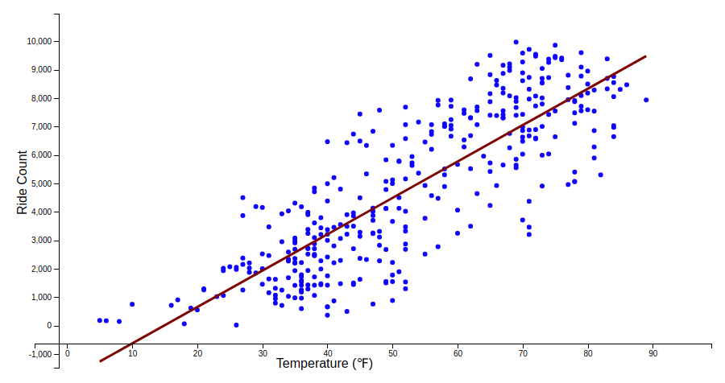
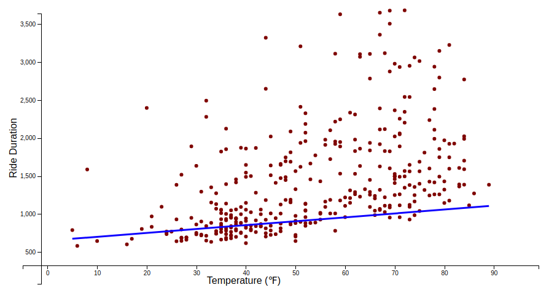
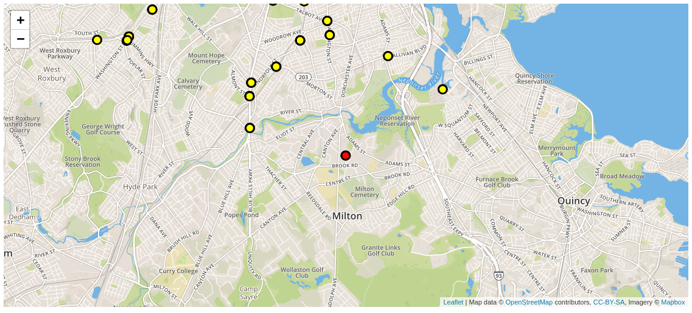
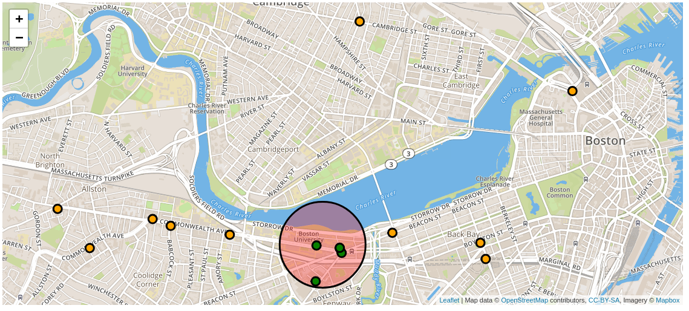

# CS 504 Report
***Chen Garber***

## Rationale

I drive to BU every day. I feel bad for doing so - my car causes pollution and traffic - but given where I live, there's no reasonable environmentally friendly alternative. It's a 30 minute drive, a 90 minute commute by train, and biking in the winter is nearly impossible because of freezing temperatures and obstructed bike lanes.

As such, I wanted to examine what it's like for various commuters in Boston, specifically train riders and Bikeshare users for whom data is readily available and transportation is environmentally friendly.

## Collecting Data

Data came from four portals. 

1) `data.boston.gov` has data on universities in Boston, including their locations and student body size.
2) Bluebike, a bikeshare program, publishes all rides taken in their network, including time, origin, destination, and the age and gender of the rider.
3) The NOAA has free weather data, including daily average, minimum, and maximum temperatures for all of 2018.
4) The MBTA publishes all of their routes, stations, and service alerts via an API which I scraped.

## Transforming Data

### Bluebike

I took the Bluebike trip data and did a `groupby` on date to count the number of rides and average ride duration on each date. Then I did a mongo `lookup` (relational join) with the weather dataset to get a collection of documents which had each day of 2018, including temperature, number of rides, and average ride duration for each day.

Additionally I calculated, for each university, where students and faculty live (where they leave from to get to the university). To do this I found all bluebike stations within a mile of each university, then I filtered bluebike rides for weekday rides between 7 and 11 AM, and counted, for each university, which stations were popular to leave from in order to get to a station within a mile of the university.

### MBTA

For the MBTA data I filtered alerts to only those which pertain to the orange, green, red, and blue train lines. This made the data less noisy, as it had shuttle and bus and other information. Again I did a `groupby` by date and joined the dataset with the weather data, resulting in a dataset with each day of 2018 along with the temperature and number of service alerts.

## Statistical Analysis and Optimization

Using Scipy, I calculated the correlation coefficient and p-value between number of bike rides and temperature, and again for average ride duration and temperature. Then I used Scipy to calculate a line of best fit for the above two datasets.

I repeated the above for the MBTA service alert dataset.

Finally I asked - if Bluebike were to add a station to their network, where should the place it? I used Python's z3-solver to determine where to place the station by making the objective to maximize the distance from all of the stations to the new station. This allows the network to expand and offer service to people living outside of the network.

One constraint was that the new station had to be within a mile of at least 3 other stations. This prevented the station from being placed too far away, unreachable by the rest of the network. Another constraint was a simple longitude constraint because Boston is on the coast and several times the solver placed the new station in the ocean.

The solver ran quite slowly the first few times so one thing I did to reduce the number of constraints and the complexity of the objective is to cluster all 300 stations into 50 clusters using k-means. This means that instead of maximizing the distance from the new station to all 300 stations, we're maximizing the distance to the 50 clusters, but the algorithm still works because those 50 clusters are located approximately where all of the stations are.

## Results

There was a strong correlation between temperature and bike ride count (correlation of 0.831 with a p-value of 0 to 10 digits after the decimal). There was also a strong correlation between bike ride duration and temperature (correlation of 0.421 with a p-value of 0 to 5 decimal places). This was expected, it's not a great discovery, but it's good to be able to quantify the exact relationship between the two.

There was a weak correlation between MBTA service alerts and the temperature (correlation of -0.185 and a p-value of 0.008). This was a surprising result, I wasn't sure there would be any correlation, but clearly there is some. This doesn't mean MBTA service gets significantly worse in the cold, but it does mean that there is some relation between reduced service and cold weather. 0 degree weather resulting in an average of 9 alerts per day, while 80 degree weather resulted in an average of 4 alerts per day.

The optimization of the new Bluebike station placement places the station in Milton, MA, south of Boston. This result makes more sense when visualized with the other stations. You can view the map in the next section.

## Visualizing Results

We can graph a scatter plot of temperature and ride count, as well as temperature and ride duration. Additionally, I graph a line of best fit to show the trend in the data (although it's very obvious for the first case). 

I also map the Bluebike stations and the new station:

I also map Boston University. The red circle is the university, the green dots are stations at the university, and the orange dots are the stations from which people ride to BU.

## Conclusion

Commuting in Boston gets harder in the winter. It's harder to bike, the train gets less convenient, and, speaking from years of being here, traffic gets worse. 

Some of these are impossible to fix - we can't make it warmer so that more people choose to bike. We can, however, make a greater effort to clear bike lanes of snow and obstructions in the winter, and we can run analysis on the train system and figure out why service is impacted in the cold, replacing and maintaining the pieces of infrastructure required to keep trains running.

## Further Work

There's more analysis to do on the above data but what would really be interesting is using the data predictively to improve commuting. The important thing about this data is that it's geographically specific - it tells us specifically where our bottlenecks are. 

We can use the Bluebike data to see which stations are frequently out of bikes (as happens frequently), and add bikes or larger stations preemptively, increasing the availability of bikes and thus increasing ridership.

We can use MBTA service alert data to find out specifically why there are more service alerts in the cold. Making trains more convenient in the cold helps commuters get around when the weather is harsh. A frequent reason people give to driving instead of taking the train is that the train is inconvenient. Increasing reliability chips away at the driving population.
