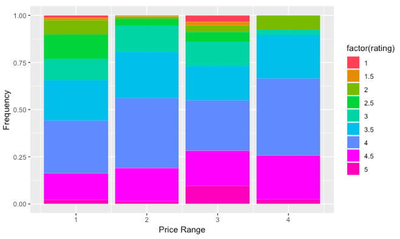
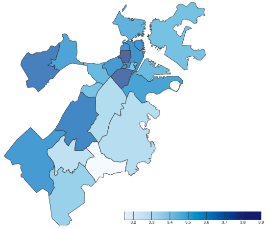

# Project #3: Final Report
**Duy Nguyen** and **Sarah M'Saad** and **Colleen Kim** and **Kelly Zhang**

## How to run this code?

### About mongoDB
- If the mongoDB is not running on the localhost, like how this code initially set-up, there must be an ssh tunnel to the server.
`ssh -L 27017:localhost:27017 user@example.org`

### Additional Libraries
- z3
- GeoPy

## Introduction
As of 2018, over 11,000 eateries were operating in the Greater Boston region, and faced with the challenges to survive, each restaurant does its best to stand out. From the uniqueness of the dishes to the ambience and location, everything is utilized by eateries to ensure that customers are satisfied and come back for more. But customers also face challenges when trying to pick 1 out of 11,000 eateries to dine at. Preferences such as cuisine, price, distance, and even time of day become important deciding factors for locals. And for tourists unfamiliar with Boston, navigating through Boston’s cityscape let alone picking a restaurant to dine at can be overwhelming. To help both tourists and locals, we utilize datasets relating to the city of Boston, and based on where the user wants to start their day in Boston, we find and recommend eateries. To see which eateries are safer to eat at we use a dataset from Analyze Boston containing food inspection violations that go back as far as 2007. And to see how popular each restaurant is, we use data from the Yelp Fusion API and collect data on restaurant and bars around Boston. And finally, we use GeoPy to evaluate distances between recommended eateries, and the user’s starting point. Using these datasets, we use z3 to choose eateries to recommend.

## Tools
For data storage, we use mongoDB to store and interact with data through a simple interface, and to manipulate data we utilize pandas which is specialized for tabular data which our project works with. Data portals we use include the Yelp Fusion API, Analyze Boston, and the datamechanics.io. The Yelp Fusion API is used for gathering rating data, but it returns significantly less data than anticipated, and when cross referenced with the list of food violations for eateries from Analyze Boston. 8,000 businesses were available from Yelp but only 3,000 were extracted. And although the Fusion API provides reviews on businesses, only 3 reviews are returned for each business. We originally discussed the idea of using natural language processing to extract sentiment from reviews to include in our list of constraining factors, but because of the limited number of reviews we decided to use Fusion to collect only restaurant number ratings. On the other hand, using Analyze Boston’s API we are able to extract 200 megabytes worth of information from the Food Establishment Inspection data. Although we have more data, algorithm run time on the data took much longer than expected, and so as a compromise we compress the raw data and push it into datamechanics.io. By doing so, algorithm run time decreases significantly, but at the cost of being unable to refresh the data as available on Analyze Boston. A potential solution to this would be a daily cron job to update the data on datamechanics.io with the most updated version of the data on Analyze Boston, but within the scope of the class we do not incorporate this into the pipeline. We also planned on using the Google Maps API to calculate distance, but decided to use GeoPy instead. Although it requires additional installation, GeoPy simplifies the process of calculating distances. And to choose eateries we use z3 which also required additional installation.

## Algorithms and Analysis Techniques
In the beginning of our working pipeline, we import food inspection data from Analyze Boston. We calculate the average food violation rate for each restaurant, and then we incorporate rating data from the Yelp Fusion API. Finally, we use z3 to approach restaurant selection as a constraint satisfaction problem, where the user provides the following constraints as input: location, minimum and maximum travel distance, average rating requirement, average acceptable violations. Location is used as a starting location of where the user would like to start their day in Boston, and using GeoPy we are able to determine acceptable eateries based on the given minimum and maximum distances. Using these constraints and GeoPy we return a list of places the user can go to, which in trial mode is 5 places, and otherwise 500.

## Exploratory Data Analysis 

To help users get a better idea of the available eateries in Boston, we also provide visualizations of the data gathered using R. In figure 1 is a graph that shows the relationship between price range and restaurant rating. There is a positive relationship here, indicating that the more expensive a restaurant is, the better ratings it gets. There are no one-star reviewed restaurant within the price range of '$$$$' which is somewhat expected. 


**Figure 1:** Graphs showing a positive relationship between the price range and rating of a restaurant.

Now, we try to understand the relationship between neighbourhood and price/rating. Figure 2 is a graph showing the restaurant densities, mean rating, and mean price for eateries in a neighborhood. As can be seen, Chinatown has the highest density of eateries, while North End has the highest mean rating per restaurant, and Charlestown/South Boston are the most expensive neighborhoods.


**Figure 2:** Graph showing the density, mean rating, and mean price of neighborhoods in Boston; Chinatown is the densest, North End has the highest mean ratings, and Charlestown/South Boston is the most expensive.

In addition, figure 3 is a visual mapping of violation rate and figure 4 is a visual of mean rating in neighborhoods.


**Figure 3:** Visual mapping of violation rate by neighborhood.


**Figure 4:** Visual mapping of average rating by neighborhood.

And figure 5 shows the what type of cuisine each neighborhood has the most of; Most of North End’s eateries are Italian, and Chinatown has a high density of chinese food and Back Bay has a high amount of hotels/sandwiches/cocktailbars. 


**Figure 5:** Showing of neighborhood restaurant count by cuisine.

## Statistical Analysis and Modelling

To further understand the relationship between variables in our dataset, we conduct many statistical analysis techniques.

### Rating and Price

From our EDA above, we noticed that there is a relationship between price and rating. So, we transformed the price range into a continuous variable (from 1 to 4, repective with the number of dollar signs a restaurnt holds). We assume this transformation is legitimate since we want to understand the increasing relationship of price in comparison with rating. We saved this variable as `price_new`. Then, we calculated their p-value (using t-test distribution) and their correlation coefficient. And then model the results using a linear regression model.


**Figure 6:** Graphs showing a positive relationship between the price range and rating of a restaurant.

From figure 6, we can see that the fitted line has barely a positive slope (0.02016 coefficient). And the price and rating correlation coefficient is equal to 0.02 with a significant p-value (2.2e-16). This means that there is no real correlation which is interesting to note: good quality restaurants can be cheap and bad quality restaurants can also be expensive. However, these findings are all based on yelp reviewers which can be biased. 

### Neighborhood Density and Rating

Now, we try to find a correlation between density of a neighbourhood (restaurant per acre) and the mean_rating. First, to get this dataset, we projected the zip code each of the restaurants into its respective neighbourhood (an approximate). Then, we merged it with the Analyze Boston Neighborhood Dataset to get the volume in acres. We found that the correlation coefficient between density and mean_rating is 0.2 which is a high number. Furthermore, we fitted these variables by using a linear regression model and found that the coefficient is 0.05372 (with a p-value of 0.009, highly significant). Therefore, we conclude that density matters in terms of average rating of the restaurant. So highly busy/dense neighbourhoods have higher quality restaurants. Back Bay and North End are the prime example for the City of Boston.


**Figure 7:** Graphs showing a positive relationship between the density and average rating of a neighbourhood.

Also, we tried to understand whether the violation rate of a given restaurant affects the quality of a food establishment or vice-verse. Therefore, we conducted some statistical analysis on these variables to further understand their relationship.
We found that their correlation coefficient is equal to -0.08, which denotes a negative relationship. The higher the violation, the lower the rating. Here's a plot of the linear regression model. The slope of the fitted line is negative (-0.0023). 


**Figure 8:** Graphs showing a positive relationship between the density and average rating of a neighbourhood.

## How to Run

Normally:
```
python execute.py kzhang21_ryuc_zui_sarms
```

Trial Mode:
```
python execute.py kzhang21_ryuc_zui_sarms -t
```
