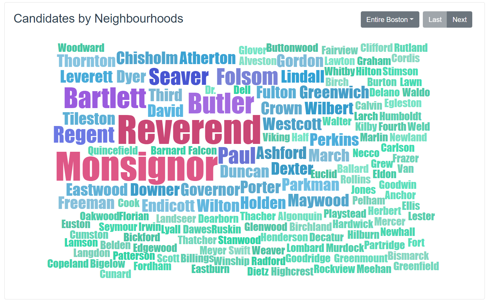

# Report

## Previous Work

The `streetbook` of this project is a legacy dataset inherited from the previous team, which features all streets in Boston with their zipcodes, full names, name without last word, and two **Gender** attributes.

To determine the gender of each street, they trimmed the name of the street to obtain only the probably "human name" part, then use two webservice independtly to predict the gender by the actual name. The results are stored in `Gender` and `Gender2`.

## Visualization

We used a webpage to visualize our results. In the webpage, you can see all layers in the map including street clustering, candidates per-district and per-cluster; also we show the word cloud of each distict/cluster's street names so that you can have a general idea of the entire program.

As for techinical architecture, our **Frontend** is built with [Vue.js](https://vuejs.org) framework, which obtains data through RESTful APIs provided by our [Flask](http://flask.pocoo.org/) server.

### Map

Map display library is provided by [Mapbox](https://www.mapbox.com/about/maps/) using data from [OpenStreetMap](https://www.openstreetmap.org/about/). We display 4 layers in the map:

- Boston Districts (always shown)
- Candidates Per-District (optional)
- Streets highlighted by K-Means Clusters (optional)
- Candidates Per-Cluster (optional)

### Word Cloud

We used the [VueWordCloud](https://github.com/SeregPie/VueWordCloud) component to show street names with their sizes by weight. There are multiple word clouds, including word cloud for each district and each cluster. Some buttons is placed on the top-right corner of the card panel for user interaction or control.