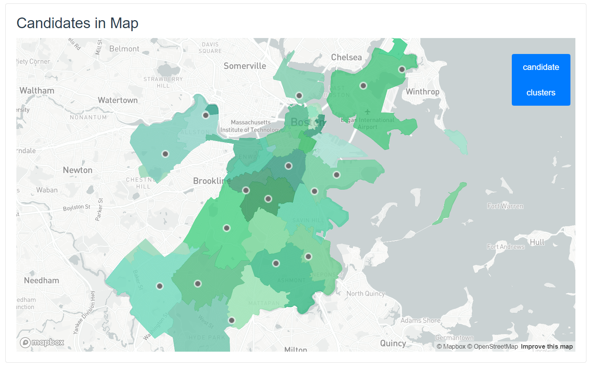
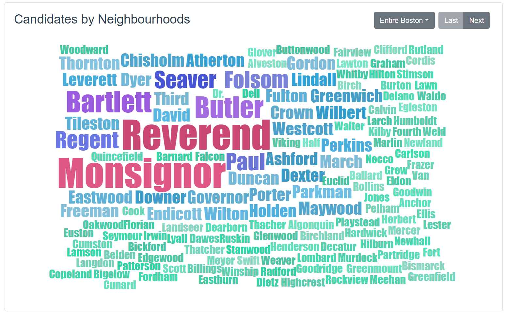

# Taking Gender Equity to the Streets(https://github.com/mmao95/course-2019-spr-proj/tree/master/mmao95_dongyihe_weijiang_zhukk)
> Maoxuan Zhu, Dongyi He, Wei Jiang, Kaikang Zhu

This is a Spark! project. Representation is one of MOWA's priority areas. We recognize that male names and pronouns are often the default and given Boston's long parochial history, we want to make sure our City represents its current demographics (52% women). That said, we'd also like to know if there are streets that are good candidates for re-naming (repetitive, etc.).

The goal is to have an interactive site that allows the city and the public to evaluate the different options for renaming based on the different variables provided.  
Most of the needed sets already exist, just need to be analyzed.

## Project #1
In this part we retrived some datasets and managed to transform them into some meaningful datasets using relational primitives.

### Street Book
After our contacts with BU Spark! staff, we get this Street Book dataset which mainly describes basic information of `Street Name`, `Gender`, `Zipcodes`, `Rank`, etc. Therefore, we fully use this dataset with our Famous People one to get related data and generate a new dataset named Filtered_ famous_poeple_streets.

### Famous People
This dataset comes from [https://www.50states.com/bio/mass.htm](https://www.50states.com/bio/mass.htm). We parsed names of famous people and stored them into MongoDB with their `full_name`, `first_name`, `last_name` and `middle_name`.

### UberMovementData
In uber_movement_data.py, we merge two datasets from https://movement.uber.com/?lang=en-US. One of those is uber traffic census data and another one is a json file which store corresponding information of street id and street details. Firstly, we project source positions and aggregate on them. Then we join 2 datasets, select and project to get the final results.

### Colleges and Universities
This dataset comes from [http://bostonopendata-boston.opendata.arcgis.com/datasets/cbf14bb032ef4bd38e20429f71acb61a_2.csv](http://bostonopendata-boston.opendata.arcgis.com/datasets/cbf14bb032ef4bd38e20429f71acb61a_2.csv). For origin dataset, we select and project specific columns(Name, Address, City, Zipcode, Latitude, Longitude) and construct a new dataset named colleges_and_universities. In addition, we store this new dataset in mongodb with the column name mentioned before.

### Public libraries
This dataset can be derived from [http://bostonopendata-boston.opendata.arcgis.com/datasets/cb00f9248aa6404ab741071ca3806c0e_6.csv](http://bostonopendata-boston.opendata.arcgis.com/datasets/cb00f9248aa6404ab741071ca3806c0e_6.csv). For this dataset, we re-arrange the columns and store them into MongoDB with column name `Branch Name`, `Address`, `City`, `Zipcode`, `Latitude`, `Longitude`, `Numbers`.

### Landmarks
This dataset can be derived from [http://bostonopendata-boston.opendata.arcgis.com/datasets/7a7aca614ad740e99b060e0ee787a228_3.csv](http://bostonopendata-boston.opendata.arcgis.com/datasets/7a7aca614ad740e99b060e0ee787a228_3.csv). For the origin dataset, we fill in the missing values and select rows that its column "Petiton" > 15. Then project to have a dateset have six cloumns: `Petition`, `Name of landmarks`, `Areas_Desi`, `Address`, `Neighbourhood`, `ShapeSTWidth`. Besides, based on Landmarks dataset and Colleges and Universities dataset, we filter the data and use `City` as the key value to get a new dataset which desrcibes the features related to street names.

## Project #2
In this part, we filtered and optimized existing datasets from multiple datasets in project 1. In addition, we used K means to solve a constraint satisfaction problem and implemented statistical analysis.

### Famous_people
We updated `famous_people` produced in project 1 with a new data source [United States Famous People](https://www.smithsonianmag.com/smithsonianmag/meet-100-most-significant-americans-all-time-180953341/), such that streets like `Washington St` will not be renamed.

### Filtered_famous_people_streets
With the dataset `famous_people`, we remove streets whose names are any of famous people's first names or last names. We used the MongoDB built-in filter syntax to improve efficiency. The output `filtered_famous_people_streets` is the input of later-on steps.

### Streetbook_filtered
Given the datasets in project 1, we filtered unnecessary entries from Landmarks, Famous people, Colleges and Universities and Uber Movement data, etc. Besides, for redundant street names, we processed corresponding rows given their redundant times and gave an alternate dataset.

### Candidate_Res
What we do in this part is to calculate duplicate counts and nearby lankmarks of a given street in filtered streetbook. Then we calculate the correlation coefficient of duplicate times and nearby lankmarks and find it barely related to each other. Lastly, we group those streets based on their zipcode and get the one with the largest duplicate counts and least nearby lankmarks.

### Streetbook_kmeans
In this part, we combine filtered_streetbook and streetbook_alternate to obtain a dataset containing redundant street names and its own zip code. Then we use their zip codes to implement k-means algorithm to separate these streets into different clusters. We hope that street names which are renamed can be distributed in different districts as many as possible.

## Project #3

The `streetbook` of this project is a legacy dataset inherited from the previous team, which features all streets in Boston with their zipcodes, full names, name without last word, and two **Gender** attributes.

To determine the gender of each street, they trimmed the name of the street to obtain only the probably "human name" part, then use two webservice independtly to predict the gender by the actual name. The results are stored in `Gender` and `Gender2`.

To visualize our result, you just need to run 'python app.py' under backend. After the flask server starts, you can vist http://127.0.0.1:5000/ to operate.

## Visualization

We used a webpage to visualize our results. In the webpage, you can see all layers in the map including street clustering, candidates per-district and per-cluster; also we show the word cloud of each distict/cluster's street names so that you can have a general idea of the entire program.

As for techinical architecture, our **Frontend** is built with [Vue.js](https://vuejs.org) framework, which obtains data through RESTful APIs provided by our [Flask](http://flask.pocoo.org/) server.

### Map

Map display library is provided by [Mapbox](https://www.mapbox.com/about/maps/) using data from [OpenStreetMap](https://www.openstreetmap.org/about/). We display 4 layers in the map:

- Boston Districts (always shown)
- Candidates Per-District (optional)
- Streets highlighted by K-Means Clusters (optional)
- Candidates Per-Cluster (optional)

### Word Cloud

We used the [VueWordCloud](https://github.com/SeregPie/VueWordCloud) component to show street names with their sizes by weight. There are multiple word clouds, including word cloud for each district and each cluster. Some buttons is placed on the top-right corner of the card panel for user interaction or control.
