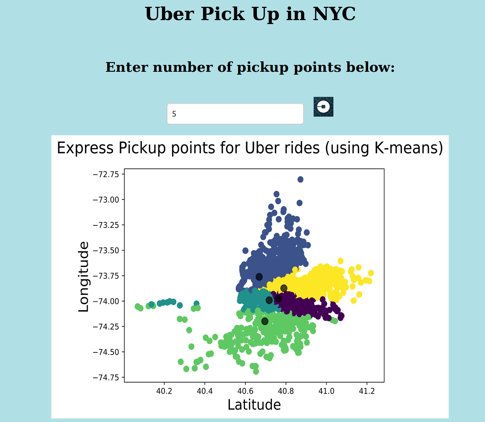

Team Members: Miranda Rivera and Omar Sagga
# Project 3: An interactive webservice to compute the express pick-up points for Uber rides in NYC

This project build on top of the work done in Project 2. In this project, we provide a webservice that implements a backend server to
compute the k-mean on a provided dataset loaded from a mongo database. The frontend side of this webservice provides an interactive website
that allows the user to try to input a different values for the number of Uber
express pickup points (translates to the number of clusters `k`), then it
displays the corresponding graph that it fetches from the backend server.

Given the heavy computation time of k-means, the backend server can run in
`trail` mode, where it only takes a subset of the whole dataset used. It also
implements a caching mechanism so that graphs with the same `k` value don't
need to be re-computed, and served immediately.

## How to run: 

First make sure you have Mongo database setup (follow the guidelines in [here](../README.md#mongodb-infrastructure))
  - Run the execute script as follows to populate the mongo database
      ```bash
      cd ..
      python3 execute.py mriver_osagga [-t]
      ```
      use the `-t` for trail mode (faster runtime)
  - After populating the database, you can simply run the Flask based webserver
    as follows:
    ```bash
    cd mriver_osagga/webserver/
    python3 webserver.py
    ```
    - Now the webserver will be serving on `localhost:5000`

### Screenshot


## Notes:

- The poster can be found [here](./UberPickUpPoster.pdf)
- The final report can be found [here](./CS%20504-%20Final%20Report.pdf)

